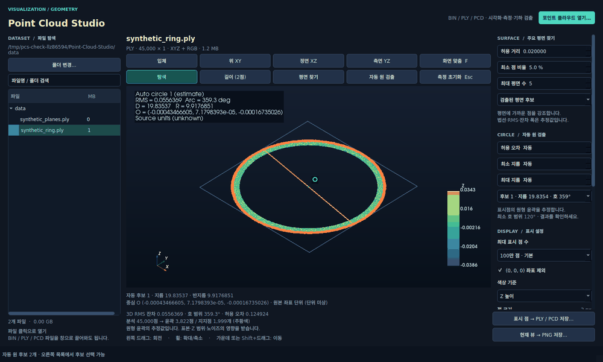
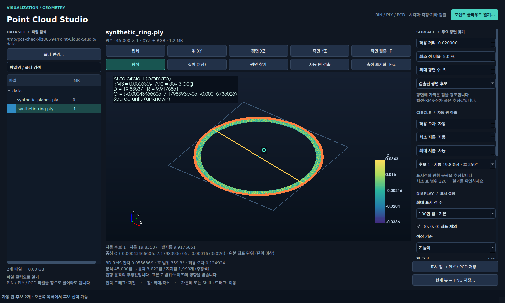

# Point Cloud Studio

**Point-cloud visualization, measurement, and geometric feature detection.**




*The demonstration uses generated geometry. No customer scans are included.*

## Overview

Point Cloud Studio is a Python desktop workspace for visualizing and geometrically inspecting XYZ/RGB point clouds. It combines interactive VTK rendering with a PyQt5 interface, NumPy geometry analysis, and readers for PLY, PCD, and a documented binary layout.

Load a scan, adjust its display budget and Z range, then inspect dominant planes or estimate circular boundaries without manually selecting circle points. Two-point distance measurement, coordinate readouts, and PLY/PCD export support further analysis. Coordinates remain in the source file's units throughout the workflow.



## Features

- **Point-cloud inspection:** rotate, pan, zoom, switch standard views, and choose parallel or perspective projection.
- **File support:** open PLY, PCD, and the BIN layout described below; browse folders or drag files into the window.
- **Large-file display:** scan valid coordinates in chunks and select an evenly distributed display sample. The default display budget is one million points; an all-valid-points option is available.
- **Automatic circle detection:** estimate planar circular contours and display diameter, radius, center, RMS residual, and supported arc coverage.
- **Dominant-plane detection:** find multiple planes, select a candidate, and inspect its supporting points, normal, RMS residual, and maximum deviation.
- **Two-point measurement:** select displayed points to read their coordinates, distance, and XYZ differences.
- **Display controls:** filter the Z range and color points by coordinate, original RGB, or a uniform color.
- **Export:** save the displayed point subset as binary PLY/PCD with its original RGB, or capture the annotated 3D viewport as PNG.
- **Cancellable processing:** loading and geometry detection run in worker threads. Changing the input invalidates obsolete detection results.

The current interface and detailed user guide are in Korean. This README provides an English introduction and setup guide.

## Workflow proposal: Viewer and Inspection

**Status: proposed workflow organization.** This repository ships one application named **Point Cloud Studio**, with all the implemented features listed below available together. Viewer and Inspection describe possible future workspaces within this application. A mode selector, separate packages, and mode-specific launch commands have not been implemented.

This proposal replaces the earlier Lite/Pro terminology with names that describe each workflow:

- **Viewer** would group file loading, navigation, display controls, Z-range filtering, and point-cloud export.
- **Inspection** would retain the Viewer tools and add two-point measurements, automatic circular-contour detection, and dominant-plane detection.

Here, inspection means geometric exploration and estimation. The application does not currently provide calibrated metrology, tolerance-based acceptance decisions, or inspection reports.

### Features matrix

The Viewer/Inspection columns describe the proposed grouping of existing tools; the final column records what is available in the current single application.

| Capability | Viewer — proposed | Inspection — proposed | Current application |
| --- | --- | --- | --- |
| BIN / PLY / PCD loading, folder browsing, and drag-and-drop | Included | Included | Implemented |
| Interactive rotation, pan, zoom, and standard views | Included | Included | Implemented |
| Display sampling, point size, and coordinate / RGB coloring | Included | Included | Implemented |
| Z-range filtering and invalid-coordinate handling | Included | Included | Implemented |
| Displayed-point export to PLY / PCD and viewport capture to PNG | Included | Included | Implemented |
| Two-point distance and XYZ difference measurement | — | Included | Implemented |
| Automatic planar circular-contour detection and diameter estimates | — | Included | Implemented |
| Dominant-plane detection, supporting points, normals, and residuals | — | Included | Implemented |

### Shared technology

Both proposed workspaces would share the existing **Python, PyQt5, VTK, and NumPy** core. The distinction is the set of tools shown for a task; it does not imply different performance, dependencies, or licensing tiers. The current release has no custom C++ engine, QML/QRHI interface, PCL integration, or Open3D integration.

### Advanced scope to define

The current detection targets are **nearly planar circular boundaries** and **dominant planes**. Circular-boundary fitting does not establish that an object is a cylindrical hole or determine its depth.

The following are possible future extensions, not implemented capabilities or committed deliverables:

- Three-dimensional region selection, measurement-result export, and saved inspection sessions.
- Refining measurements against original source points independently of the display sample.
- Three-dimensional cylinder or sphere fitting, with target geometry and acceptance tolerances to be specified.
- Part or shape classification, with the object classes and reference data to be defined.
- Live LiDAR acquisition or robot-cell integration, with the sensor SDK, interfaces, and coordinate calibration to be selected.

### Project identity

This repository is an independent project by [WannaSleep3254](https://github.com/WannaSleep3254). It is not affiliated with [OpenAEC Foundation's Open Pointcloud Studio](https://github.com/OpenAEC-Foundation/open-pointcloud-studio).

## Run locally

Python 3.10+, NumPy, PyQt5, VTK, and a graphical desktop with OpenGL support are required. The application has been validated on Linux with Python 3.10, PyQt5 5.15, VTK 9.1, and NumPy 1.21.

From the project directory, using a Python environment with the dependencies installed:

```bash
python3 -m pip install -r requirements.txt
python3 viewer.py
```

The app starts with its local `data/` directory, which is empty in this distribution. Use **포인트 클라우드 열기…** (Open point cloud) or **폴더 변경…** (Change folder), drag in a supported file, or provide a path:

```bash
python3 viewer.py /path/to/scan.ply
python3 viewer.py --root /path/to/scans
```

The Linux launcher uses `/usr/bin/python3`, so its dependencies must be installed for that interpreter:

```bash
./run.sh
POINT_CLOUD_STUDIO_RENDER=software ./run.sh
```

The launcher can fall back to Mesa software rendering when its OpenGL check fails. Software rendering may be slower with large display samples. Use `POINT_CLOUD_STUDIO_RENDER=hardware` to disable that fallback.

## Controls

| Action | Control |
| --- | --- |
| Rotate / zoom | Left drag / mouse wheel |
| Pan | Middle drag or Shift + drag |
| Fit displayed points | `F` |
| Open a file | `Ctrl+O` |
| Measure a distance | **길이 (2점)**, then click two points; or Shift + click |
| Detect planes | **평면 찾기** |
| Detect circular contours | **자동 원 검출** |
| Clear measurements and cancel detection | `Esc` |

Detection uses the displayed point subset after Z filtering. Zooming the camera alone does not narrow the analysis region.

## Formats and measurement scope

| Format | Reading | Writing |
| --- | --- | --- |
| PLY | ASCII, binary little-endian and big-endian; XYZ with optional RGB | Binary little-endian XYZ + RGB |
| PCD 0.7 | ASCII, binary, LZF `binary_compressed`; XYZ with optional packed or separate RGB | Binary XYZ + packed RGB |
| BIN | 8-byte header: two big-endian uint32 dimensions; then 15-byte records: little-endian float32 XYZ + uint8 RGB | — |

- BIN support is limited to this exact layout, with file size `8 + width × height × 15` bytes.
- Imported PLY/PCD coordinates are retained as float64. Export preserves the coordinate precision of the displayed array.
- Exports contain the displayed subset and source RGB, excluding normals, descriptors, mesh faces, organized layout, and viewpoint metadata. Detection overlays are captured in PNG, not PLY/PCD.
- Non-finite coordinates are discarded. Origin points `(0, 0, 0)` are excluded by default; the checkbox can include them.
- Circle detection estimates nearly planar circular boundaries; it does not fit sphere or cylinder diameters. Short arcs, occlusion, noise, and noncircular shapes can prevent a valid result.
- Plane residuals describe the fitted points; they are not a certified flatness measurement. Disconnected coplanar regions may belong to one candidate.
- Physical units come from the input coordinates and are not inferred or converted. Sampling and tolerance settings affect the results.

## Implementation

| Module | Responsibility |
| --- | --- |
| `viewer.py` | PyQt5 interface, VTK scene, interaction, and worker lifecycle |
| `cloud_io.py` | BIN reader, chunked statistics and sampling, PLY/PCD export |
| `point_formats.py` | PLY/PCD parsing, temporary disk staging, and LZF decoding |
| `auto_circle.py` | PCA projection, contour extraction, RANSAC, and circle refinement |
| `surface_detection.py` | Sequential plane RANSAC, least-squares refinement, and point assignment |
| `measurements.py` | Measurement-point validation and circle result representation |

Geometry and file handling use NumPy. Detection results carry generation identifiers so a completed worker cannot redraw results for an input that has already changed.

## Tests

```bash
python3 -m unittest discover -s tests -v
```

The 28 tests use generated data and temporary files. They cover circle fitting, multiple plane orientations and memberships, distance-point validation, format variants, compressed PCD decoding, coordinate/RGB round trips, malformed input, and cancellation. No external dataset is required.

See [사용설명.txt](사용설명.txt) for the detailed Korean user guide.
